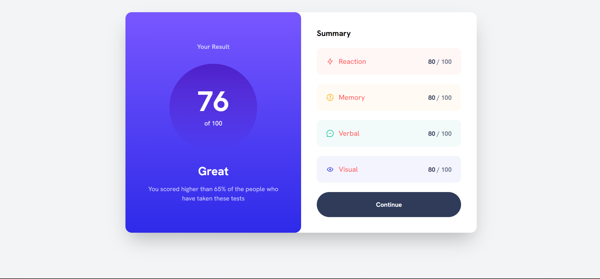

# Results Summary Card Tailwind

## Descripción

Este proyecto es una tarjeta de resumen de resultados desarrollada con Tailwind CSS. La tarjeta muestra los resultados de un test y fue creada como una práctica de habilidades de diseño y desarrollo front-end con Tailwind. No tiene funcionalidad interactiva; es un componente visual para fines de demostración y aprendizaje.

## Vista Previa



## Tecnologías

Este proyecto fue desarrollado con las siguientes tecnologías:

[](https://skillicons.dev)

## Instalación

Para utilizar este proyecto, sigue estos pasos:

1. Clona el repositorio:
    ```bash
    git clone https://github.com/AlexPerez7/Results-summary-card-Tailwind.git
    ```
2. Navega al directorio del proyecto:
    ```bash
    cd results-summary-card-tailwind
    ```
3. Abre el archivo `index.html` en tu navegador para ver la tarjeta.

## Uso

Este proyecto es un componente visual que puedes incorporar en tus propios proyectos de front-end. Puedes personalizar el diseño y el contenido de la tarjeta editando el archivo `index.html` y los estilos en `tailwind.config.js` y en las clases del html.
